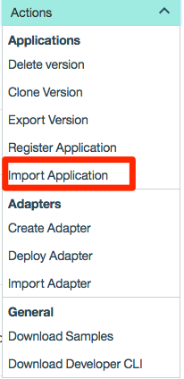

# Add Login Approvals to your Digital Channels with MobileFirst Foundation

## Prerequisites

1. [Installed Git](https://git-scm.com/book/en/v2/Getting-Started-Installing-Git)
2. [Install NodeJS / npm](https://docs.npmjs.com/getting-started/installing-node)
3. [Install MobileFirst Platform Foundation 8.0 Server](https://mobilefirstplatform.ibmcloud.com/tutorials/en/foundation/8.0/installation-configuration/development/mobilefirst/)
4. [Set up the Android development environment](https://mobilefirstplatform.ibmcloud.com/tutorials/en/foundation/8.0/installation-configuration/development/android/)
5. [Pre-installed IBM MobileFirst Platform development environment](https://mobilefirstplatform.ibmcloud.com/tutorials/en/foundation/8.0/setting-up-your-development-environment/).
6. [Understanding the IBM MobileFirst Foundation Authentication and Security](https://mobilefirstplatform.ibmcloud.com/tutorials/en/foundation/8.0/authentication-and-security/).
7. [Understanding the IBM MobileFirst Foundation Java Adapters](https://mobilefirstplatform.ibmcloud.com/tutorials/en/foundation/8.0/adapters/java-adapters/).
8. [Understanding the IBM MobileFirst Foundation Push Notifications](https://mobilefirstplatform.ibmcloud.com/tutorials/en/foundation/8.0/notifications/).

## Running the sample

- Clone this repository   

 ```bash
 $ git clone https://github.com/mfpdev/login-approval-sample.git
 ```


* Deploy the `LoginApprovalsAdapter` adapter:
   * Build and deploy the adapter using mfpdev CLI:
     * From a **Command-line**, navigate to the **LoginApprovalsAdapter** project's root folder
     * Build by executing `mfpdev adapter deploy`
   * This adapter contains the following:
     * LoginApprovalsAdapter - resource adapter
     * UserLogin - security check
     * WebUserLogin - security check   


* Register and configure the apps in [MobileFirst Foundation Console](http://localhost:9080/mfpconsole/)
  * Configure the Firebase Cloud Messaging by following [this link](https://mobilefirstplatform.ibmcloud.com/tutorials/en/foundation/8.0/notifications/sending-notifications/#google-cloud-messaging--firebase-cloud-messaging)

  * Import the apps configuration:
    * From the action menu choose `Import Application` and select `export_applications_com.github.mfpdev.loginapprovals_web_none.zip` under `login-approvals/config` folder and press on deploy on the next screen.




* Your applications (Android and Web) is now registered and configured.


> Working with **geolocation** api in browsers:
Please note that you if you are not connect to localhost you may need a secure connection to use the **geolocation** api.
[To learn more about it please read the following](https://developers.google.com/web/updates/2016/04/geolocation-on-secure-contexts-only). There is already httpProxy for https which bind to port 8443 in **app.js**


  ### Supported Levels
  IBM MobileFirst Platform Foundation 7.1

  ### License
  Copyright 2016 IBM Corp.

  Licensed under the Apache License, Version 2.0 (the "License");
  you may not use this file except in compliance with the License.
  You may obtain a copy of the License at

  http://www.apache.org/licenses/LICENSE-2.0

  Unless required by applicable law or agreed to in writing, software
  distributed under the License is distributed on an "AS IS" BASIS,
  WITHOUT WARRANTIES OR CONDITIONS OF ANY KIND, either express or implied.
  See the License for the specific language governing permissions and
  limitations under the License.
