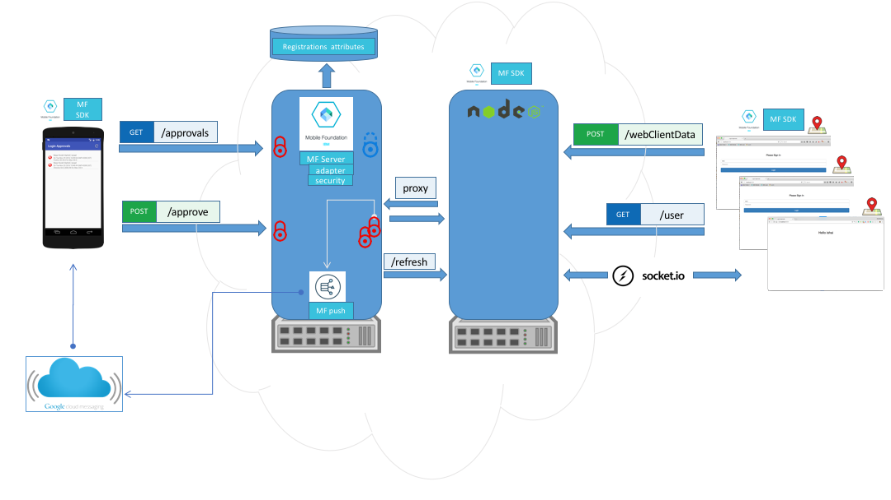

# Add Login Approvals to Your Digital Channels with MobileFirst Foundation

This sample implements a push-based, one-tap experience to verify user identity with [IBM MobileFirst Foundation](https://mobilefirstplatform.ibmcloud.com). A mobile app with a logged in user gets a push notification for any login request made from untrusted web browser. The user can approve or deny the login request.  The app then shows a list trusted browsers with details like location, time and platform.  Later the user can revoke any of the browser.

## Demo
<a href="http://www.youtube.com/watch?feature=player_embedded&v=ajumb5iOblE" target="_blank"></a>

## Prerequisites

1. [Installed Git](https://git-scm.com/book/en/v2/Getting-Started-Installing-Git)
2. [Install NodeJS / npm](https://docs.npmjs.com/getting-started/installing-node)
5. [Pre-installed IBM MobileFirst Platform development environment](https://mobilefirstplatform.ibmcloud.com/tutorials/en/foundation/8.0/setting-up-your-development-environment/)
4. [Set up the Android development environment](https://mobilefirstplatform.ibmcloud.com/tutorials/en/foundation/8.0/installation-configuration/development/android/)
6. [Understanding the IBM MobileFirst Foundation Authentication and Security](https://mobilefirstplatform.ibmcloud.com/tutorials/en/foundation/8.0/authentication-and-security/)
7. [Understanding the IBM MobileFirst Foundation Java Adapters](https://mobilefirstplatform.ibmcloud.com/tutorials/en/foundation/8.0/adapters/java-adapters/)
8. [Understanding the IBM MobileFirst Foundation Push Notifications](https://mobilefirstplatform.ibmcloud.com/tutorials/en/foundation/8.0/notifications/)

## Running the sample

- Clone this repository   

 ```bash
 $ git clone https://github.com/mfpdev/login-approval-sample.git
 ```


* Deploy the `LoginApprovalsAdapter` adapter:
   * Build and deploy the adapter using mfpdev CLI:
     * Open a **Command-line** terminal, navigate to the **LoginApprovalsAdapter** project's root folder
     * Build by executing `mfpdev adapter build`
     * Deploy by executing `mfpdev adapter deploy`
   * This adapter contains the following:
     * LoginApprovalsAdapter - resource adapter
     * UserLogin - security check
     * WebUserLogin - security check   


* Register and configure the apps in [MobileFirst Foundation Console](http://localhost:9080/mfpconsole/):

  * Import the apps configuration
    * From the action menu choose `Import Application` and select `export_applications_com.github.mfpdev.loginapprovals_web_none.zip` under `login-approvals/config` folder and press on deploy on the next screen.


  * Configure the Firebase Cloud Messaging by following [this link](https://mobilefirstplatform.ibmcloud.com/tutorials/en/foundation/8.0/notifications/sending-notifications/#google-cloud-messaging--firebase-cloud-messaging).


  

  * Add a confidential client with the following data:

| Title   |      Value      |
|----------|:-------------|
| Client ID |  approval|
| Client Secret |    approval   |
| Allowed Scope |push.application.com.github.mfpdev.loginapprovals messages.write |   


  > The confidential client will be used to get an access token with a scope that allows sending push notifications. for more information see [Sending Notifications in MobileFirst Foundation 8.0](https://mobilefirstplatform.ibmcloud.com/tutorials/en/foundation/8.0/notifications/sending-notifications/#sending-the-notification).


* Your applications (Android and Web) is now registered and configured.

* Install the web app:
  * Open a **Command-line** terminal, navigate to the **node-web-app** project's root folder
     * Build by executing `npm install`
     * Run the web app by executing `npm start`

* Run the app:
  * From Android Studio import the Android project from **LoginApprovals** folder
  * Run the application.
  * Go to the web browser and navigate to [http://localhost:6004](http://localhost:6004) or to [https://localhost:8443](https://localhost:8443)
  * Login first on your Android app (username == password) and then login with the same user in the browser.


> Working with **geolocation** api in browsers:
If you are not connected to http://localhost you may need a secure connection to use the **geolocation** api.
To learn more about it read the following [link](https://developers.google.com/web/updates/2016/04/geolocation-on-secure-contexts-only). This sample already has httpProxy for https which binds to port 8443 in **app.js**.

## Architecture


### Supported Levels
IBM MobileFirst Foundation 8.0

### License
Copyright 2016 IBM Corp.

Licensed under the Apache License, Version 2.0 (the "License");
you may not use this file except in compliance with the License.
You may obtain a copy of the License at

http://www.apache.org/licenses/LICENSE-2.0

Unless required by applicable law or agreed to in writing, software
distributed under the License is distributed on an "AS IS" BASIS,
WITHOUT WARRANTIES OR CONDITIONS OF ANY KIND, either express or implied.
See the License for the specific language governing permissions and
limitations under the License.
